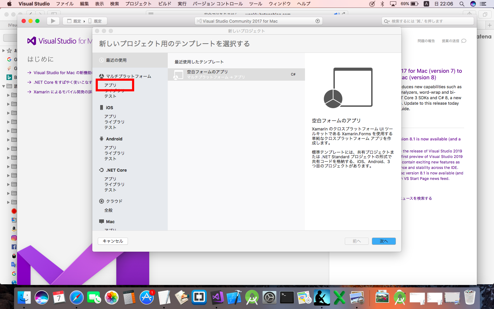

# Xamarin勉強会
(環境構築編)

---
## 目次

* 1.インストールをしてみよう!!
* 2.プロジェクトを新規で作ってみよう!!
* 3.構成の解説
* 4.シミュレータを立ち上げてみよう
* 5.まとめ
---

## 1.インストールをしてみよう!!
* まずWindows,iOSどちらでも、基本visual studioをインストールしましょう。
* 下記からインストールしてください。
* https://visualstudio.microsoft.com/ja/free-developer-offers/

---
## 2.プロジェクトを新規で作ってみよう!!

* インストールは、できたでしょうか?
* それでは、立ち上げてみましょう!!
* 下記アイコンをクリックで立ち上がってきます。
* (下記はMacのアイコンですが、Windowsも同じかと思います。)
* 

+++
## 2.プロジェクトを新規で作ってみよう!!

* 下記のような画面が立ち上がってきたかと思います。
* 
* 赤枠部分の「アプリ」を押下してください。
